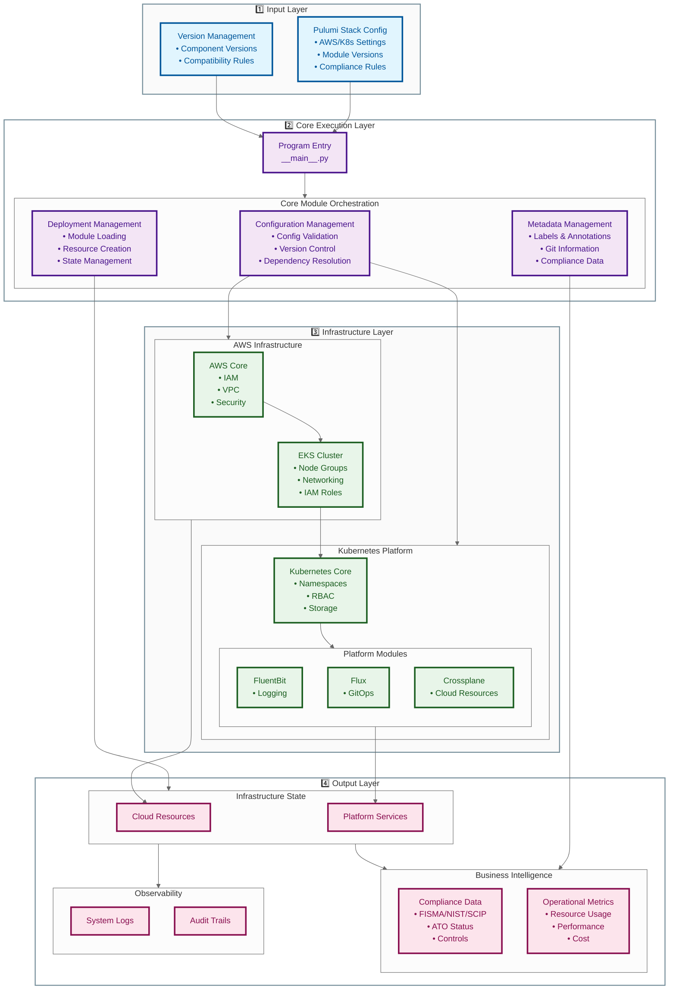

# Zora: Cloud-Agnostic Infrastructure as Code Framework

## Overview

Welcome to **Zora**, an open-source platform engineering framework designed to simplify and accelerate the deployment of cloud infrastructure across multiple providers. Zora empowers teams to build, deploy, and manage cloud-native applications with confidence, ensuring compliance, security, and scalability from the ground up.

Zora leverages modern Infrastructure as Code (IaC) practices using Pulumi and Python, providing a type-safe, modular, and maintainable codebase. It abstracts the complexities of cloud environments, enabling you to focus on innovation rather than infrastructure management.

---

## Table of Contents

- [Features](#features)
- [Getting Started](#getting-started)
- [Documentation](#documentation)
- [Contributing](#contributing)
- [Community and Support](#community-and-support)
- [License](#license)

---

## Features

- **Cloud-Agnostic Architecture**: Deploy infrastructure across AWS, Azure, GCP, and Bare Metal Kubernetes from a unified codebase.
- **Compliance Automation**: Integrate compliance controls directly into your infrastructure code.
- **Type-Safe Infrastructure as Code**: Leverage Python's type annotations and `TypedDict` for reliable and maintainable code.
- **Modular Design**: Build reusable modules that can be developed and deployed independently.
- **Developer-Friendly Tools**: Utilize modern development tools like Poetry, Pyright, and GitHub Actions.
- **Scalability and Flexibility**: Easily scale your infrastructure and adapt to changing requirements.
- **Enhanced Developer Experience**: Simplify workflows with self-service capabilities and clear documentation.

---



---

## Getting Started

Zora provides a robust starting point for building cloud infrastructure. Follow the steps below to set up your development environment and start deploying with Zora.

### Prerequisites

- **Git**: Version control system ([Download Git](https://git-scm.com/downloads))
- **Docker**: Containerization platform ([Install Docker](https://docs.docker.com/get-docker/))
- **Visual Studio Code (VSCode)**: Code editor ([Download VSCode](https://code.visualstudio.com/))
  - **Remote Development Extension Pack**: [Install Extension Pack](https://marketplace.visualstudio.com/items?itemName=ms-vscode-remote.vscode-remote-extensionpack)

### Clone the Repository

1. **Fork the Zora Repository**

   Navigate to the [Zora GitHub repository](https://git.smce.nasa.gov/scip/Zora) and click the "Fork" button to create your own copy.

2. **Clone Your Forked Repository**

   ```bash
   git clone https://git.smce.nasa.gov/<project_namespace>/Zora.git
   cd zora
   ```

### Set Up the Development Environment

Zora uses a DevContainer configuration to provide a consistent development environment.

1. **Open the Project in VSCode**

   Launch VSCode and open the `zora` directory.

2. **Reopen in Container**

   - When prompted, click **"Reopen in Container"** to start the DevContainer.
   - If not prompted, open the Command Palette (`Ctrl+Shift+P` or `Cmd+Shift+P` on Mac) and select **"Remote-Containers: Reopen in Container"**.

3. **Wait for the Container to Build**

   VSCode will build the DevContainer image and set up the environment. This may take a few minutes on the first run.


### Configure Pulumi

1. **Set Up Pulumi Configuration**

   Ensure that `Pulumi.yaml` configuration is updated with your desired configuration:

   ```yaml
   name: Zora
   runtime:
     name: python
     options:
       virtualenv: poetry
   ```
### Install Dependencies

1. **Install Pulumi Dependencies**

   ```bash
   pulumi install
   ```

2. **Log In to Pulumi**

   ```bash
   pulumi login
   ```

3. **Create a New Stack**

   ```bash
   pulumi stack init dev
   ```

   Replace `dev` with your desired stack name.

### Verify Type Checking

Zora enforces strict type checking using Pyright.

1. **Install Pyright**

   ```bash
   poetry add --dev pyright
   ```

2. **Run Type Checking**

   ```bash
   poetry run pyright
   ```

### Deploy Your Infrastructure

1. **Preview the Deployment**

   ```bash
   pulumi preview
   ```

2. **Deploy with Pulumi**

   ```bash
   pulumi up
   ```

3. **Destroy Resources**

   When you're done, you can clean up resources:

   ```bash
   pulumi destroy
   ```

---

## Documentation

Explore our comprehensive documentation to get the most out of Zora:

- **[Developer Guide](./docs/developer_guide/README.md)**: Learn about development practices, code standards, and how to contribute.
- **[Pulumi Python Development Guide](./docs/developer_guide/pulumi-python.md)**: Advanced techniques and best practices for Pulumi with Python.
- **[Core Module Documentation](./docs/modules/core/README.md)**: Understand the core components and architecture of Zora.
- **[Documentation Style Guide](./docs/developer_guide/documentation.md)**: Guidelines for writing clear and consistent documentation.
- **[Roadmap](./docs/developer_guide/ROADMAP.md)**: Learn about our vision, goals, and future plans for Zora.

---

## Contributing

We welcome contributions from the community! To get involved:

1. **Read the [Contributor Guide](./CONTRIBUTING.md)**: Familiarize yourself with our contribution process, coding standards, and community guidelines.

2. **Join Our Community**: Engage with other contributors and maintainers.

   - **Discord**: Join our [CHAT_SERVER_NEEDED](placeholder) server.
   - **GitHub Discussions**: Participate in discussions on our [GitHub Discussions](https://git.smce.nasa.gov/scip/zora/discussions) page.

3. **Report Issues**: If you find bugs or have feature requests, please [open an issue](https://git.smce.nasa.gov/scip/zora/issues).

4. **Submit Pull Requests**: Follow our guidelines to submit high-quality pull requests.
