```mermaid
%%{init: {'theme': 'neutral'}}%%
flowchart TB
    %% Style Definitions
    classDef configStyle fill:#fff3e0,stroke:#ef6c00,stroke-width:3px,color:#ef6c00
    classDef containerStyle fill:#e3f2fd,stroke:#1565c0,stroke-width:3px,color:#1565c0
    classDef toolStyle fill:#f3e5f5,stroke:#6a1b9a,stroke-width:3px,color:#6a1b9a
    classDef docStyle fill:#e8f5e9,stroke:#2e7d32,stroke-width:3px,color:#2e7d32
    classDef ciStyle fill:#fce4ec,stroke:#c2185b,stroke-width:2px,color:#c2185b

    %% 1. Project Configuration
    subgraph ProjectConfig["1️⃣ Project Configuration"]
        direction TB

        subgraph BuildConfig["Build Configuration"]
            direction TB
            PyProject["pyproject.toml<br/>• Dependencies<br/>• Build Settings<br/>• Tool Configurations"]:::configStyle
            SetupCfg["setup.cfg<br/>• Package Metadata<br/>• Entry Points<br/>• Tool Settings"]:::configStyle
        end

        subgraph QualityConfig["Quality & Testing"]
            direction TB
            MyPy["mypy.ini<br/>• Type Checking<br/>• Error Handling"]:::configStyle
            Pyright["pyrightconfig.json<br/>• Static Analysis"]:::configStyle
            PyTest["pytest.ini<br/>• Test Configuration"]:::configStyle
        end

        subgraph EditorConfig["Editor Settings"]
            direction TB
            VSCode["settings.json<br/>• Editor Preferences<br/>• Extension Settings"]:::configStyle
            CursorRules[".cursor/cursorrules<br/>• AI Assistant Rules"]:::configStyle
        end
    end

    %% 2. Container Configuration
    subgraph ContainerConfig["2️⃣ Container Configuration"]
        direction TB

        subgraph BaseConfig["Base Configuration"]
            direction TB
            Dockerfile["Dockerfile<br/>• Base: containercraft/devcontainer<br/>• System Packages<br/>• Environment Setup"]:::containerStyle
            DevContainerJson["devcontainer.json<br/>• VS Code Integration<br/>• Port Forwarding<br/>• Mount Points"]:::containerStyle
        end

        subgraph Features["Container Features"]
            direction TB
            DockerFeatures["Docker Support<br/>• Docker-in-Docker<br/>• Socket Mount"]:::containerStyle
            SecurityFeatures["Security & Access<br/>• UID/GID Mapping<br/>• SSH & GPG"]:::containerStyle
        end
    end

    %% 3. Development Tools
    subgraph DevTools["3️⃣ Development Tools"]
        direction TB

        subgraph CoreTools["Core Development"]
            direction TB
            Python["Python Ecosystem<br/>• Python 3.11<br/>• pip & poetry"]:::toolStyle
            Git["Git Tools<br/>• git & gh cli<br/>• lazygit"]:::toolStyle
            Shell["Shell Tools<br/>• zsh & tmux<br/>• starship"]:::toolStyle
        end

        subgraph CloudTools["Infrastructure"]
            direction TB
            Pulumi["Pulumi SDK<br/>• AWS/K8s/Azure<br/>• State Management"]:::toolStyle
            K8s["Kubernetes Tools<br/>• kubectl & helm<br/>• k9s & kind"]:::toolStyle
            Cloud["Cloud CLIs<br/>• aws & azure<br/>• gcloud"]:::toolStyle
        end

        subgraph DevEnv["Development Environment"]
            direction TB
            Editors["Code Editors<br/>• VS Code Server<br/>• Neovim + LazyVim"]:::toolStyle
            Debug["Development Tools<br/>• Debugging<br/>• Linting"]:::toolStyle
        end
    end

    %% 4. Documentation
    subgraph Docs["4️⃣ Documentation"]
        direction TB

        subgraph UserDocs["User Documentation"]
            direction TB
            Setup["Setup Guide<br/>• Installation<br/>• Configuration"]:::docStyle
            Usage["Usage Guide<br/>• Instructions<br/>• Examples"]:::docStyle
        end

        subgraph TechDocs["Technical Documentation"]
            direction TB
            API["API Documentation<br/>• Interfaces<br/>• Type Definitions"]:::docStyle
            ModuleDocs["Module Documentation<br/>• Core/AWS/K8s<br/>• Architecture"]:::docStyle
        end

        subgraph Standards["Standards"]
            direction TB
            CodeStandards["Code Standards<br/>• Style Guide<br/>• Best Practices"]:::docStyle
            DocStandards["Doc Standards<br/>• Templates<br/>• Markdown Rules"]:::docStyle
        end
    end

    %% 5. CI/CD & Automation
    subgraph CICD["5️⃣ CI/CD & Automation"]
        direction TB

        subgraph Workflows["GitHub Actions"]
            direction TB
            TestFlow["Test Workflows<br/>• Unit/Integration<br/>• Coverage"]:::ciStyle
            LintFlow["Quality Checks<br/>• Linting<br/>• Type Checking"]:::ciStyle
            DeployFlow["Deployment<br/>• Infrastructure<br/>• Documentation"]:::ciStyle
        end

        subgraph Automation["Development Automation"]
            direction TB
            Hooks["Git Hooks<br/>• Pre-commit<br/>• Post-merge"]:::ciStyle
            Tools["Automation Tools<br/>• Runme<br/>• Release Tools"]:::ciStyle
        end
    end

    %% Main Flow Connections
    BuildConfig --> QualityConfig --> EditorConfig
    BaseConfig --> Features
    CoreTools --> CloudTools --> DevEnv
    UserDocs --> TechDocs --> Standards
    Workflows --> Automation

    %% Cross-section Connections
    ProjectConfig --> ContainerConfig
    ContainerConfig --> DevTools
    DevTools --> Docs
    DevTools --> CICD

    %% Subgraph Styles
    style ProjectConfig fill:#f8f9fa,stroke:#78909c,stroke-width:2px
    style ContainerConfig fill:#ffffff,stroke:#78909c,stroke-width:2px
    style DevTools fill:#f8f9fa,stroke:#78909c,stroke-width:2px
    style Docs fill:#ffffff,stroke:#78909c,stroke-width:2px
    style CICD fill:#f8f9fa,stroke:#78909c,stroke-width:2px
```

# Devcontainer User Guide

This document provides comprehensive information on using the ContainerCraft Devcontainer with the project. The devcontainer ensures that all project dependencies are met, streamlining both development and deployment processes. By utilizing the devcontainer, you eliminate the need for manual dependency installation and reduce the overhead of maintaining environment configurations.

---

## Table of Contents

- [Introduction](#introduction)
- [About the Devcontainer](#about-the-devcontainer)
  - [Source Repository](#source-repository)
  - [Key Features](#key-features)
- [Getting Started](#getting-started)
  - [Prerequisites](#prerequisites)
  - [Cloning the Repository](#cloning-the-repository)
- [Using the Devcontainer](#using-the-devcontainer)
  - [VSCode Integration](#vscode-integration)
    - [Opening the Project in VSCode](#opening-the-project-in-vscode)
  - [Command-Line Access](#command-line-access)
    - [Launching the Devcontainer Manually](#launching-the-devcontainer-manually)
- [Configuration Details](#configuration-details)
  - [Devcontainer Configuration Files](#devcontainer-configuration-files)
  - [Customizing the Devcontainer](#customizing-the-devcontainer)
- [Included Tools and Dependencies](#included-tools-and-dependencies)
  - [Programming Languages](#programming-languages)
  - [Core Utilities](#core-utilities)
  - [Development Tools](#development-tools)
  - [Cloud Native Tools](#cloud-native-tools)
- [Environment and User Configuration](#environment-and-user-configuration)
  - [Environment Variables](#environment-variables)
  - [User and Permission Model](#user-and-permission-model)
- [For AI and LLM Agents](#for-ai-and-llm-agents)
- [Troubleshooting](#troubleshooting)
- [Additional Resources](#additional-resources)
- [Community and Support](#community-and-support)

---

## Introduction

The project leverages a comprehensive devcontainer to provide a consistent and fully-configured development environment. This devcontainer is sourced from the [ContainerCraft Devcontainer](https://github.com/containercraft/devcontainer.git) repository and includes all the necessary tools, libraries, and configurations required for the project.

By using the devcontainer, developers can:

- **Eliminate Manual Setup**: No need to install project dependencies individually.
- **Ensure Consistency**: All team members work in the same environment.
- **Reduce Onboarding Time**: New contributors can start developing immediately.
- **Simplify Documentation**: Focus on project-specific instructions without repetitive setup guides.

---

## About the Devcontainer

### Source Repository

The devcontainer used in the Zora project originates from the [ContainerCraft Devcontainer](https://github.com/containercraft/devcontainer.git) repository. This repository provides a set of Docker images designed for cloud-native development, pre-configured with essential tools and optimized for infrastructure projects.

### Key Features

- **Multi-Architecture Support**: Compatible with both `amd64` and `arm64`.
- **Docker-in-Docker Capabilities**: Run Docker inside the container.
- **Multiple Development Modes**: Supports VSCode, Neovim, and Code-Server.
- **Comprehensive Tooling**: Includes Kubernetes tools, Pulumi, Helm, and more.
- **Security-Focused Configuration**: Optimized user and permission models.
- **Custom Shell Enhancements**: Features Starship prompt and tmux configurations.

---



---

## Getting Started

### Prerequisites

To use the devcontainer with the Zora project, ensure you have the following installed:

- **Visual Studio Code (VSCode)**: [Download VSCode](https://code.visualstudio.com/)
- **Remote Development Extension Pack**: Install via the [VSCode Marketplace](https://marketplace.visualstudio.com/items?itemName=ms-vscode-remote.vscode-remote-extensionpack)
- **Docker Desktop or Docker CLI**: [Install Docker](https://docs.docker.com/get-docker/)

### Cloning the Repository

Clone the Zora repository to your local machine:

```bash
git clone https://git.smce.nasa.gov/scip/zora.git
cd zora
```

---

## Using the Devcontainer

### VSCode Integration

The devcontainer is fully integrated with VSCode, allowing for a seamless development experience.

#### Opening the Project in VSCode

1. **Open the Zora Folder**:

   Launch VSCode and open the cloned `zora` directory.

2. **Reopen in Container**:

   Upon opening the folder, VSCode should detect the `.devcontainer` configuration and prompt you to reopen the project in the container.

   - If prompted, click **"Reopen in Container"**.
   - If not prompted, open the Command Palette (`Ctrl+Shift+P` or `Cmd+Shift+P` on Mac) and select **"Remote-Containers: Reopen in Container"**.

3. **Wait for the Container to Build and Start**:

   VSCode will build the devcontainer image if necessary and start the container. This may take a few minutes on the first run.

4. **Start Developing**:

   Once the devcontainer is running, you can start coding immediately. All dependencies are installed, and tools like Pulumi and Poetry are configured.

### Command-Line Access

If you prefer to use the devcontainer via the command line or need to perform operations outside of VSCode, you can manually launch the devcontainer.

#### Launching the Devcontainer Manually

1. **Build the Devcontainer Image**:

   ```bash
   docker build -t zora-devcontainer -f .devcontainer/Dockerfile .
   ```

2. **Run the Devcontainer**:

   ```bash
   docker run -it --rm \
     --name zora-dev \
     --hostname zora-dev \
     --entrypoint bash \
     -v "$(pwd):/workspace" \
     zora-devcontainer
   ```

   This command:

   - Runs the container interactively.
   - Mounts the current directory into `/workspace` inside the container.
   - Uses `bash` as the entrypoint.

3. **Activate the Development Environment**:

   Inside the container, navigate to the workspace and activate the environment:

   ```bash
   cd /workspace
   poetry shell
   ```

4. **Start Developing**:

   You now have access to all the tools and dependencies within the devcontainer.

---

## Configuration Details

### Devcontainer Configuration Files

The Zora project includes a `.devcontainer` directory containing:

- **`Dockerfile`**: Specifies the base image (`ghcr.io/containercraft/devcontainer:extra`) and any additional setup.
- **`devcontainer.json`**: Configures VSCode settings, extensions, and container options.

### Customizing the Devcontainer

If you need to install additional tools or modify configurations:

1. **Modify the Dockerfile**:

   Add installation commands or environment variables as needed to `.devcontainer/Dockerfile`.

   ```Dockerfile
   FROM ghcr.io/containercraft/devcontainer:extra

   # Install additional dependencies (example)
   RUN set -ex \
       && apt-get update \
       && apt-get install -y <your-package> \
       && apt-get clean \
       && rm -rf /var/lib/apt/lists/*
   ```

2. **Update `devcontainer.json`**:

   Adjust settings, add extensions, or modify container options in `.devcontainer/devcontainer.json`.

   ```json
   {
     "name": "Devcontainer",
     "dockerFile": "Dockerfile",
     "settings": {
       "terminal.integrated.defaultProfile.linux": "bash"
     },
     "extensions": [
       "ms-python.python",
       "ms-azuretools.vscode-docker",
       "pulumi.pulumi"
     ],
     "postCreateCommand": "devcontainer-links",
     "forwardPorts": [8080, 1313],
     "mounts": [
       "source=/var/run/docker.sock,target=/var/run/docker.sock,type=bind"
     ],
     "runArgs": [
       "--init",
       "--privileged"
     ]
   }
   ```

3. **Rebuild the Devcontainer**:

   After making changes, rebuild the container:

   - In VSCode, open the Command Palette and select **"Remote-Containers: Rebuild Container"**.
   - Or, rebuild manually if running from the command line.

---

## Included Tools and Dependencies

The devcontainer comes pre-installed with a wide array of tools essential for the Zora project.

### Programming Languages

#### Python

- **Version**: 3.11
- **Tools**:
  - `pip`
  - `Poetry`
  - `setuptools`

#### Node.js

- **Version**: 20.x
- **Tools**:
  - `npm`
  - `yarn`

#### Go

- **Version**: 1.x

#### .NET

- **Version**: SDK 7.0

### Core Utilities

| Tool Name  | Version | Description                                | Link                                     |
|------------|---------|--------------------------------------------|------------------------------------------|
| `git`      | Latest  | Distributed version control system         | [Git](https://git-scm.com/)              |
| `gh`       | Latest  | GitHub CLI                                 | [GitHub CLI](https://cli.github.com/)    |
| `jq`       | Latest  | Command-line JSON processor                | [jq](https://stedolan.github.io/jq/)     |
| `direnv`   | Latest  | Environment variable management            | [Direnv](https://direnv.net/)            |
| `starship` | Latest  | Fast, customizable shell prompt            | [Starship](https://starship.rs/)         |
| `tmux`     | Latest  | Terminal multiplexer                       | [tmux](https://github.com/tmux/tmux)     |
| `nix`      | Latest  | Package manager and build system           | [Nix](https://nixos.org/)                |
| `runme`    | Latest  | Execute commands from README.md            | [Runme](https://runme.dev/)              |
| `task`     | Latest  | Task runner and build tool                 | [Task](https://taskfile.dev/)            |
| `lazygit`  | Latest  | Terminal UI for git commands               | [lazygit](https://github.com/jesseduffield/lazygit)|

### Cloud Native Tools

| Tool Name    | Version | Description                            | Link                                      |
|--------------|---------|----------------------------------------|-------------------------------------------|
| `kubectl`    | Latest  | Kubernetes command-line tool           | [kubectl](https://kubernetes.io/docs/tasks/tools/) |
| `k9s`        | Latest  | Terminal UI for Kubernetes clusters    | [k9s](https://k9scli.io/)                 |
| `helm`       | Latest  | Kubernetes package manager             | [Helm](https://helm.sh/)                  |
| `kubectx`    | Latest  | Switch between clusters                | [kubectx](https://github.com/ahmetb/kubectx)|
| `kubens`     | Latest  | Switch between namespaces              | [kubens](https://github.com/ahmetb/kubectx)|
| `krew`       | Latest  | Package manager for kubectl plugins    | [krew](https://krew.sigs.k8s.io/)         |
| `Pulumi`     | Latest  | Infrastructure as Code SDK             | [Pulumi](https://www.pulumi.com/)         |
| `pulumictl`  | Latest  | Pulumi control utility                 | [pulumictl](https://github.com/pulumi/pulumictl)|
| `kind`       | Latest  | Run local Kubernetes clusters          | [kind](https://kind.sigs.k8s.io/)         |
| `cilium`     | Latest  | CLI for installing and managing Cilium | [Cilium](https://cilium.io/)              |
| `istioctl`   | Latest  | Istio service mesh CLI                 | [Istioctl](https://istio.io/latest/docs/ops/diagnostic-tools/istioctl/)|
| `clusterctl` | Latest  | Kubernetes Cluster API CLI             | [Cluster API](https://cluster-api.sigs.k8s.io/)|
| `talosctl`   | Latest  | CLI tool for managing Talos clusters   | [Talos](https://www.talos.dev/)           |

### Development Tools

| Tool Name     | Version | Description                                 | Link                                        |
|---------------|---------|---------------------------------------------|---------------------------------------------|
| `neovim`      | Latest  | Vim-based text editor with extended features| [Neovim](https://neovim.io/)                |
| `LazyVim`     | Latest  | Neovim configuration framework              | [LazyVim](https://www.lazyvim.org/)         |
| `code-server` | Latest  | Run VSCode in the browser                   | [code-server](https://coder.com/)           |
| `ttyd`        | Latest  | Share terminal over the web                 | [ttyd](https://tsl0922.github.io/ttyd/)     |

---

## Environment and User Configuration

### Environment Variables

- `DEVCONTAINER`: Indicates the current devcontainer variant.
- `PATH`: Includes common binary directories and language-specific paths.
- `NIX_INSTALLER_EXTRA_CONF`: Nix configuration for system builds.
- `REGISTRY_AUTH_FILE`: Path to Docker registry authentication.
- `BIN`: Default binary installation directory (`/usr/local/bin`).
- `INSTALL`: Default binary install command (`install -m 755 -o root -g root`).
- `STARSHIP_CONTAINER`: Container name for Starship prompt.

### User and Permission Model

- **Users**:
  - `vscode` (UID 1000): Primary user with sudo privileges.
  - `runner` (UID 1001): Secondary user for GitHub Actions compatibility.
- **Groups**:
  - `sudo`: For administrative privileges.
  - `docker`: For Docker access.
- **Permissions**:
  - Password-less sudo for `vscode` and `runner`.
  - Proper file permissions set for home directories and configuration files.

---

## For AI and LLM Agents

This devcontainer is designed to meet **all** project dependencies for both users and developers. AI agents and Large Language Models (LLMs) can assume that all required tools, libraries, and configurations are present within the devcontainer environment.

Key points:

- **Comprehensive Environment**: All dependencies specified in the project are included.
- **Consistent Setup**: Eliminates discrepancies that might arise from different local environments.
- **No External Dependencies**: Agents do not need to account for missing tools or configurations.

When generating code, documentation, or performing analyses, AI agents can rely on the fact that the environment within the devcontainer is fully equipped to handle all project-related tasks.

---

## Troubleshooting

- **Container Fails to Build**:
  - Ensure Docker is running and you have sufficient permissions.
  - Check for syntax errors in the `Dockerfile` or `devcontainer.json`.
- **Extensions Not Working in VSCode**:
  - Verify that extensions are listed in the `devcontainer.json`.
  - Reload the window or rebuild the container.
- **Dependency Issues**:
  - Run `poetry install` inside the devcontainer to ensure all Python dependencies are installed.
- **Docker-in-Docker Not Working**:
  - Make sure the `--privileged` flag is set in the `runArgs` of `devcontainer.json`.
  - Ensure the Docker socket is mounted properly.

---

## Additional Resources

- **ContainerCraft Devcontainer Repository**: [GitHub Link](https://github.com/containercraft/devcontainer.git)
- **Zora Project Repository**: [GitHub Link](https://git.smce.nasa.gov/scip/zora.git)
- **VSCode Remote Development**: [Documentation](https://code.visualstudio.com/docs/remote/remote-overview)
- **Docker Documentation**: [Get Started with Docker](https://docs.docker.com/get-started/)
