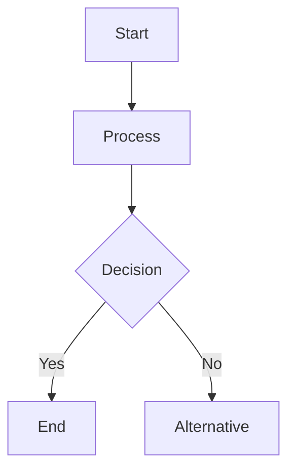
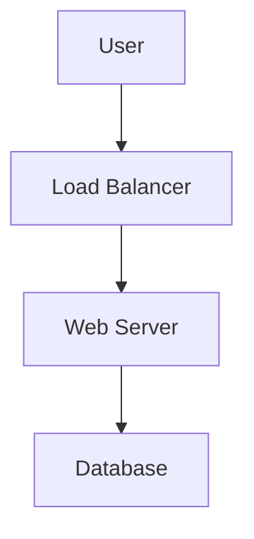
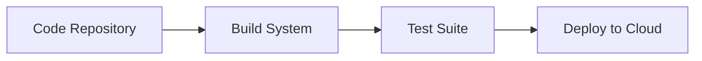
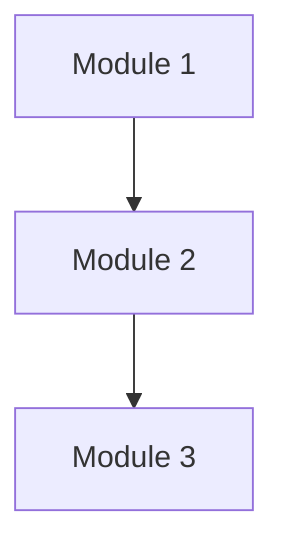

# Mermaid Diagram Standards and Hygiene for Technical Documentation

This document outlines the standards and best practices for creating accessible, clear, and professional diagrams using Mermaid.js. The guidelines are designed to support technical documentation for cloud engineering, platform engineering, DevOps, and code architectures, ensuring diagrams are optimized for readability, maintainability, and accessibility across different rendering environments, including light and dark themes.

---

## 1. Purpose and Scope

Mermaid diagrams are an essential tool for technical documentation. They provide a visual representation of complex systems, processes, and architectures. This document establishes:

- Standards for diagram hygiene.
- A matrix of color codes and types for consistent use.
- Best practices for light and dark theme compatibility.
- Guidelines for diagram layout and efficient use of space.
- Examples of diagrams for different use cases (e.g., cloud infrastructure, code architecture).

---

## 2. Key Principles

1. **Accessibility:** Ensure all elements meet a minimum contrast ratio of 4.5:1 for text and graphical elements.
2. **Clarity:** Avoid overcrowding. Use whitespace and logical groupings to improve readability.
3. **Consistency:** Apply standardized colors, fonts, and layouts.
4. **Compatibility:** Optimize diagrams for both light and dark themes.
5. **Maintainability:** Use comments and meaningful class definitions for future edits.

---

## 3. Diagram Hygiene

### 3.1 General Hygiene

- **Use Comments:** Annotate your diagram with comments to explain key elements.
- **DRY Principle:** Avoid redundant or repetitive elements.
- **Logical Flow:** Arrange elements in a clear, top-to-bottom (TB) or left-to-right (LR) flow.
- **Alignment:** Align nodes and edges for a structured look.
- **Spacing:** Maintain even spacing between nodes and subgraphs.

### 3.2 Font and Text Standards

- **Font Size:** Use default font sizes for consistency.
- **Font Color:** Ensure text is legible against the background.
- **Text Alignment:** Center-align text within nodes.
- **Labels:** Use concise, descriptive labels for nodes and edges.

---

## 4. Color Standards and Matrix

### 4.1 Color Code Formats

- **Hex Codes:** Use hexadecimal color codes for all elements.
- **Contrast Ratio:** Verify colors with a contrast checker.

### 4.2 Color Types and Usage

| Purpose               | Hex Code  | Description                        |
|-----------------------|-----------|------------------------------------|
| Node Background       | `#FAFAFA` (Light), `#333333` (Dark) | Neutral background for nodes. |
| Node Text             | `#000000` (Light), `#FFFFFF` (Dark) | High-contrast text color.      |
| Line Colors           | `#007AFF`, `#FF5733`, `#FFC300`    | Blue, red, and yellow for flows.|
| Subgraph Borders      | `#555555`                          | Neutral for subgraph grouping. |
| Highlight Elements    | `#9B51E0`                          | Violet for key regions.        |
| Error/Warning         | `#FF0000`                          | Red for errors or alerts.      |
| Success Indicators    | `#00FF00`                          | Green for successful states.   |

### 4.3 Color Usage Guidelines

- Avoid red/green combinations to ensure colorblind accessibility.
- Use mid-tone colors for elements that must work in both light and dark themes.
- Add patterns (e.g., dashed lines) for additional differentiation.

---

## 5. Mermaid Syntax and Examples

### 5.1 Standard Mermaid Syntax



### 5.2 Class Definitions

```mermaid
classDef defaultText fill:#FAFAFA,color:#000000,stroke-width:1px
classDef highlight fill:#9B51E0,color:#FFFFFF,stroke-width:2px
```

### 5.3 Applying Classes

```mermaid
A[Start]:::defaultText
B[Key Process]:::highlight
```

### 5.4 Subgraph Example

```mermaid
subgraph Cluster
    direction TB
    Node1[Service A]
    Node2[Service B]
end
```

---

## 6. Layout Optimization

### 6.1 Top-to-Bottom Layout (TB)

- Use TB layout for hierarchical processes or workflows.
- Ensure even spacing between layers.

### 6.2 Left-to-Right Layout (LR)

- Use LR layout for parallel processes or comparisons.
- Align nodes horizontally for balance.

### 6.3 Width Management

- Limit node width to maintain readability in markdown-rendered diagrams.
- Avoid overly long labels; use abbreviations if necessary.

---

## 7. Diagram Use Cases

### 7.1 Cloud Infrastructure



### 7.2 DevOps Pipeline



### 7.3 Code Architecture



---

## 8. Accessibility and Testing

### 8.1 Accessibility Guidelines

- Test diagrams with colorblind filters.
- Use patterns (dashed, dotted) to differentiate elements.

### 8.2 Testing Tools

- [Contrast Checker](https://webaim.org/resources/contrastchecker/)
- [Color Oracle](https://colororacle.org/)

---

## 9. Maintenance and Updates

- Document all changes in comments.
- Use meaningful class names for maintainability.
- Regularly review diagrams for compliance with standards.

---

This document serves as a comprehensive reference for creating professional, accessible, and effective diagrams using Mermaid.js. By adhering to these standards, teams can ensure their diagrams are clear, consistent, and maintainable.
