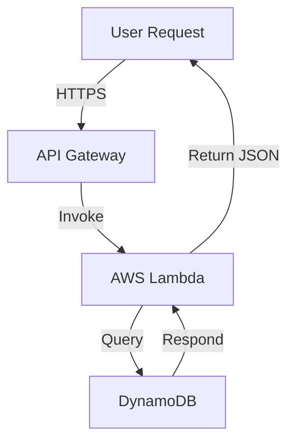
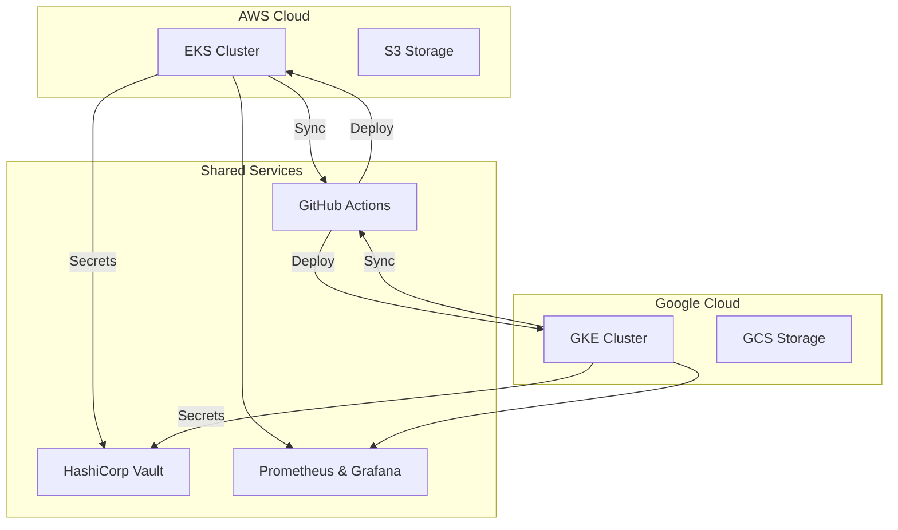
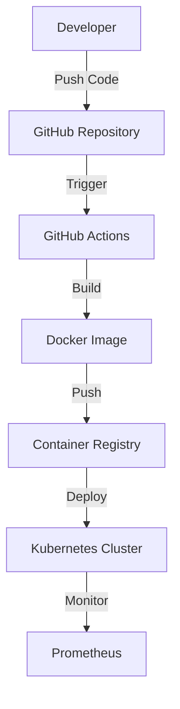
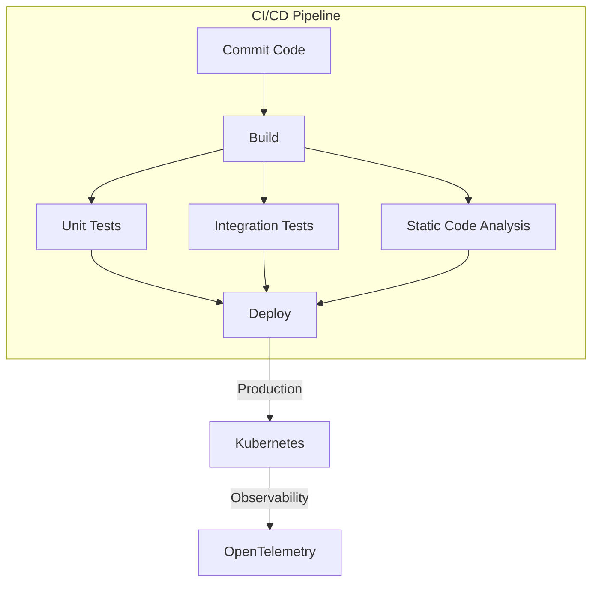
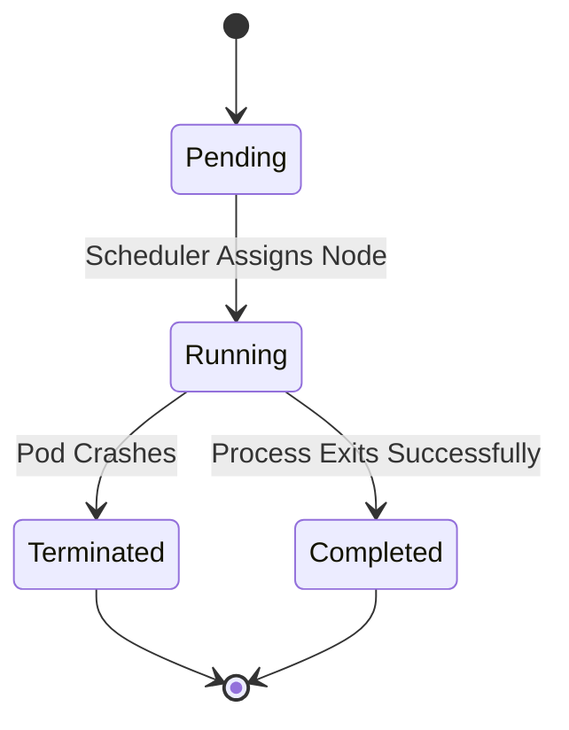
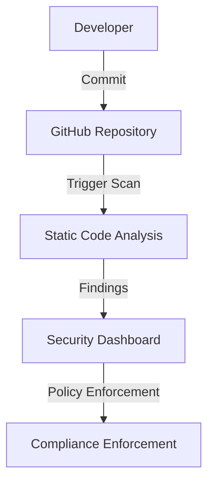

# **Comprehensive Mermaid.js Technical Reference for Cloud and Platform Engineering**

## **Introduction**

Mermaid.js is an code based diagramming and visualization tool widely utilized in **cloud engineering, platform engineering, DevOps, and system architecture documentation**. This guide offers an in-depth exploration of the Mermaid.js DSL (Domain Specific Language) syntax, best practices, and real-world applications tailored to professionals working across cloud computing paradigms.

### **Scope and Objectives**

Included:

- Instructions on **Mermaid.js syntax** and **visualization principles**.
- Demonstrations of **cloud architecture representations**, including AWS, GCP, Azure, and Kubernetes
- Present methodologies for modeling **Kubernetes workloads, CI/CD pipelines, and distributed systems**.
- Highlight **integration with documentation tools** such as Markdown, GitHub Actions, and Sphinx.
- Explain advanced **styling, theming, and accessibility considerations**.
- Illustrate **real-world examples in multi-cloud deployments, serverless applications, and infrastructure automation**.
- Optimize **workflow and security representations** for DevOps, SRE, and Technical Documentation team contributors and maintainers.

---

## **1. Getting Started with Mermaid.js**

### **1.1 Mermaid.js Setup**

Mermaid.js is supported across various platforms:

- **Markdown-based documentation** (GitHub, GitLab, Notion, Obsidian, Docusaurus)
- **Static website frameworks** (Jekyll, Hugo, MkDocs)
- **Interactive environments** (Jupyter Notebooks, VSCode)
- **Mermaid Live Editor** ([https://mermaid.live](https://mermaid.live))
- **CLI-based diagram generation**
- **Integration with Sphinx and Jupyter Book for technical documentation**

### **1.2 Embedding Mermaid.js in HTML**

```html
<script src="https://cdn.jsdelivr.net/npm/mermaid@11.4.0/dist/mermaid.min.js"></script>
<script>
    mermaid.initialize({
        startOnLoad: true,
        theme: 'forest',
        flowchart: {
            useMaxWidth: true,
            htmlLabels: true
        }
    });
</script>
```

### **1.3 Exporting Diagrams via Mermaid CLI**

```sh
npm install -g @mermaid-js/mermaid-cli
mmdc -i architecture.mmd -o architecture.png
```

> **Best Practice:** Automate diagram generation using `mermaid-cli` within GitHub Actions to ensure up-to-date documentation.

### **1.4 Integrating Mermaid.js with Jupyter Notebooks**

````python
from IPython.display import display, Markdown
md = """```mermaid
flowchart TD
    A[Start] --> B[Process]
    B --> C{Decision}
    C -->|Yes| D[Success]
    C -->|No| E[Failure]
```"""
display(Markdown(md))
````

> **Tip:** This integration enables live rendering within Jupyter Notebook reports for interactive analysis.

---

## **2. Cloud Infrastructure Flowcharts**

### **2.1 Representing Multi-Cloud Architectures**

Mermaid.js effectively models hybrid and multi-cloud deployments.

#### **Example: AWS Serverless Application Workflow**



#### **Example: Multi-Cloud Kubernetes Deployment**



---

## **3. DevOps Pipelines & CI/CD Workflows**

### **3.1 Visualizing GitHub Actions for Automated Deployment**



### **3.2 Parallelized CI/CD Execution with Security Scans**



---

## **4. Advanced Use Cases and State Diagrams**

### **4.1 Kubernetes Pod Lifecycle**



### **4.2 Cloud Governance & Security Policies**



---

## **Conclusion & Best Practices**

✅ **Leverage subgraphs for modular architecture representation**.\
✅ **Ensure high-contrast themes for accessibility and readability**.\
✅ **Optimize diagrams for parallel workflows and dependencies**.\
✅ **Use Mermaid.js CLI automation for continuous documentation updates**.\
✅ **Adopt state diagrams to capture infrastructure and application lifecycles**.

