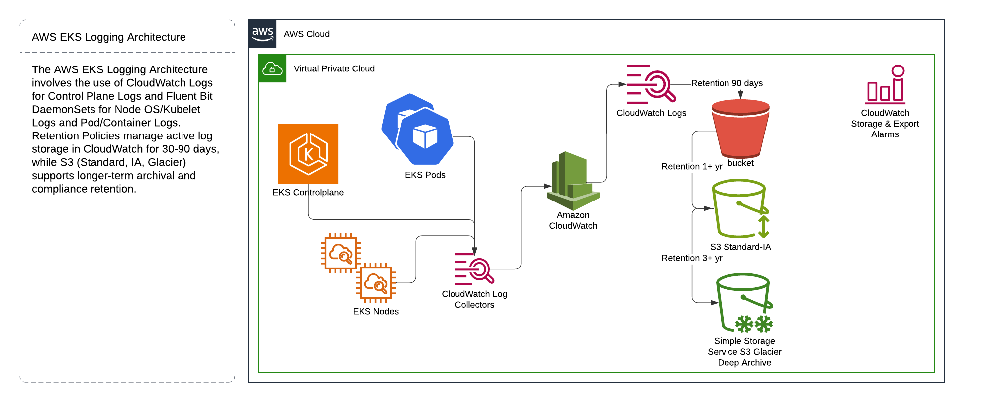
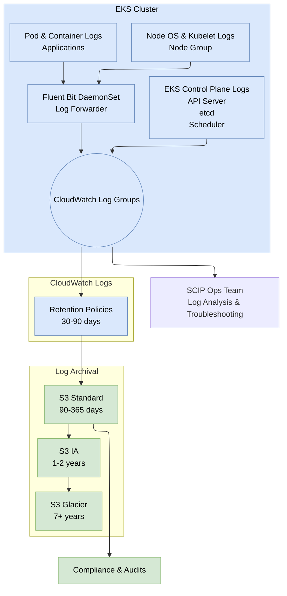

# AWS EKS Logging Architecture

AWS EKS Logging Architecture.

## Highlights
1. **Control Plane Logs** flow directly to **CloudWatch Logs** via EKS logging settings.
2. **Node OS/Kubelet Logs** and **Pod/Container Logs** use **Fluent Bit** DaemonSets for ingestion to **CloudWatch**.
3. **Retention Policies** manage active log storage in CloudWatch for 30–90 days.
4. **S3** (Standard, IA, Glacier) supports longer-term archival and compliance retention.

## Log Sources and Flow

### 1. Control Plane Logs
- **Sources**: EKS Control Plane components
  - API Server
  - Controller Manager
  - Scheduler
  - etcd
- **Flow**:
  1. EKS automatically streams Control Plane logs to **CloudWatch Logs**.
  2. Logs typically appear in a log group such as `/aws/eks/<cluster-name>/cluster`.
- **Retention**: 90 days

### 2. Node Logs
- **Sources**: EC2 instances in node groups.
  - OS logs (systemd, dmesg, etc.)
  - Kubelet logs
  - Container runtime logs
- **Flow**:
  1. A **Fluent Bit** DaemonSet runs on each node, collecting logs from the OS and container runtime.
  2. Fluent Bit forwards these logs to **CloudWatch Logs** (e.g., `/aws/eks/<cluster-name>/nodes`).
- **Retention**: 90 days

### 3. Application Logs
- **Sources**: Kubernetes pods/containers.
  - Typically application `stdout` and `stderr` logs
  - Optional log files mounted within each container
- **Flow**:
  1. **Fluent Bit** DaemonSet collects container logs from each node.
  2. Logs are forwarded to **CloudWatch Logs** (e.g., `/aws/eks/<cluster-name>/applications`).
- **Retention**: 90 days

---

## Log Lifecycle Implementation

### Phase 1: Active (CloudWatch) – 0 to 90 days
1. **Primary Source**: EKS (control plane, nodes, pods).
2. **Log Ingestion**: Collected into CloudWatch Logs.
3. **Retention**: 90 days

### Phase 2: Warm (S3 Standard) – ~90 to 365 days
1. **Export/Streaming**:
   - Export (interval): **CloudWatch export task** or **AWS Lambda scheduled task** to export logs to S3.
   - Streaming (real-time): **Kinesis Firehose delivery stream** or **CloudWatch Logs subscription filter** to stream logs to S3.
2. **S3 Bucket**: Logs stored in the **Standard** storage class.
3. **Retention**: 365 days

### Phase 3: Cool (S3 IA / S3 One Zone-IA / Deep Archive) – 1–2 years
1. **Storage Class**: S3 IA (Infrequent Access)
2. **Retention**: 2 years
3. **Access**: Occasionally accessed for analysis, compliance, and audits.

### Phase 4: Cold (S3 Glacier) – 3+ years
1. **Storage Class**: S3 Glacier
2. **Retention**: 3 years
3. **Access**: Infrequent access for compliance, audits, and regulatory requirements.

---

## Security Controls

### Encryption
- **KMS** Encrypted CloudWatch log groups and S3 buckets.

### IAM Roles and Policies
- **Least Privilege**:
  - Grant only the necessary CloudWatch write, S3 read/write, and KMS encryption permissions to Fluent Bit, Firehose, or Lambda.
- **Separation of Duties**:
  - Separate log administration roles and app development roles.
  - Separate log group IAM read/audit access from write access roles.

## Monitoring and Alerting

1. **Security Monitoring**
   - AWS Security Hub / GuardDuty anomaly detection. (?)

2. **CloudWatch Metrics**
   - **IncomingBytes**: Monitoring log group ingestion volume.
   - **S3 BucketSizeBytes** / **NumberOfObjects**: Growth tracking over time for cost forecasting.
   - **DeliverySuccess** / **DeliveryFailure**: (If streaming logs via Kinesis Firehose)

3. **Alert Configuration**
   - **High Latency or Zero Ingestion**: Trigger alerts if logs are not arriving as expected.
   - **Export Failures**: Alert on repetitive export job errors or excessive Firehose failures.
   - **S3 Storage Growth**: Monitor S3 storage growth and notify if nearing budget thresholds.

---

## References

1. [AWS EKS Documentation](https://docs.aws.amazon.com/eks/latest/userguide/logging-monitoring.html)
2. [Fluent Bit Documentation](https://docs.fluentbit.io/)
3. [AWS CloudWatch Logs](https://docs.aws.amazon.com/AmazonCloudWatch/latest/logs/WhatIsCloudWatchLogs.html)
4. [Amazon Kinesis Firehose](https://docs.aws.amazon.com/firehose/latest/dev/what-is-this-service.html)
5. [Amazon S3 Lifecycle Configuration](https://docs.aws.amazon.com/AmazonS3/latest/userguide/lifecycle-configuration-examples.html)
6. [AWS KMS](https://docs.aws.amazon.com/kms/)
7. [Security and Compliance on AWS](https://aws.amazon.com/compliance/)
